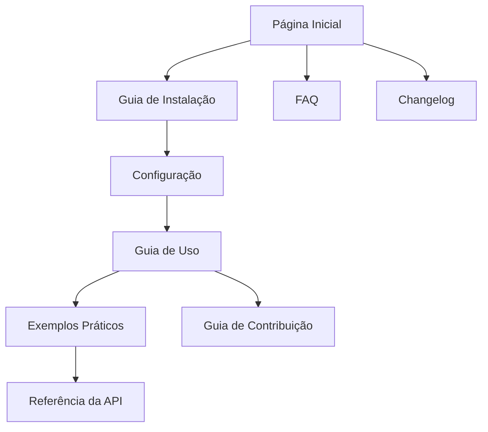

# Documento de Requisitos - Site de Documentação CommitZero

## 1. Visão Geral do Produto

Site de documentação oficial para a biblioteca CommitZero (@codemastersolutions/commitzero), um validador de Conventional Commits com CLI amigável, hooks do Git e mecanismo de regras interno - zero dependências de runtime.

O site servirá como hub central de informações para desenvolvedores que desejam implementar e usar o CommitZero em seus projetos, fornecendo documentação completa, exemplos práticos e guias de implementação.

O objetivo é criar uma experiência de documentação moderna e acessível que facilite a adoção da biblioteca e reduza a curva de aprendizado dos usuários.

## 2. Funcionalidades Principais

### 2.1 Papéis de Usuário

| Papel | Método de Acesso | Permissões Principais |
|-------|------------------|----------------------|
| Desenvolvedor | Acesso direto via web | Pode navegar, pesquisar e acessar toda documentação |
| Contribuidor | Acesso via GitHub | Pode sugerir melhorias na documentação via issues/PRs |

### 2.2 Módulo de Funcionalidades

Nosso site de documentação consiste nas seguintes páginas principais:

1. **Página Inicial**: hero section com apresentação da biblioteca, navegação principal, cards de funcionalidades principais, estatísticas do projeto.
2. **Guia de Instalação**: instruções detalhadas de instalação via npm/yarn/pnpm, configuração inicial, verificação da instalação.
3. **Configuração**: documentação completa do arquivo de configuração, exemplos práticos, opções avançadas.
4. **Guia de Uso**: comandos CLI detalhados, exemplos de uso, casos de uso comuns, troubleshooting.
5. **Referência da API**: documentação técnica das funções exportadas, tipos TypeScript, exemplos de código.
6. **Exemplos Práticos**: casos de uso reais, integrações com diferentes workflows, templates de configuração.
7. **Guia de Contribuição**: instruções para contribuidores, padrões de código, processo de desenvolvimento.
8. **FAQ**: perguntas frequentes, soluções para problemas comuns, dicas de otimização.
9. **Changelog**: histórico de versões, breaking changes, roadmap futuro.

### 2.3 Detalhes das Páginas

| Nome da Página | Nome do Módulo | Descrição da Funcionalidade |
|----------------|----------------|----------------------------|
| Página Inicial | Hero Section | Apresentar a biblioteca com título, descrição, badges de status, botões de ação (Get Started, GitHub) |
| Página Inicial | Cards de Funcionalidades | Exibir principais recursos: CLI amigável, Git hooks, zero dependências, validação de commits |
| Página Inicial | Estatísticas | Mostrar downloads npm, versão atual, compatibilidade Node.js, licença MIT |
| Guia de Instalação | Instalação Local | Comandos npm/yarn/pnpm para instalação como dev dependency |
| Guia de Instalação | Uso Único | Comando npx para execução sem instalação |
| Guia de Instalação | Verificação | Comandos para verificar instalação correta |
| Configuração | Arquivo de Config | Documentar commitzero.config.json/js com todas as opções |
| Configuração | Exemplos Práticos | Templates de configuração para diferentes cenários |
| Configuração | Validação | Explicar regras de validação e como customizar |
| Guia de Uso | Comandos CLI | Documentar todos os comandos: init, lint, check, install-hooks, commit |
| Guia de Uso | Git Hooks | Explicar instalação e funcionamento dos hooks |
| Guia de Uso | Pre-commit | Gerenciamento de comandos pre-commit |
| Referência da API | Funções Exportadas | Documentar rules, parser, formatter com exemplos TypeScript |
| Referência da API | Tipos | Definições de tipos e interfaces |
| Exemplos Práticos | Workflows | Integração com GitHub Actions, GitLab CI, outros |
| Exemplos Práticos | Casos de Uso | Projetos monorepo, bibliotecas, aplicações |
| Guia de Contribuição | Setup Desenvolvimento | Instruções para configurar ambiente de desenvolvimento |
| Guia de Contribuição | Padrões | Coding standards, commit conventions, PR guidelines |
| FAQ | Troubleshooting | Soluções para problemas comuns |
| FAQ | Compatibilidade | Informações sobre Node.js, sistemas operacionais |
| Changelog | Histórico de Versões | Lista de mudanças por versão |
| Changelog | Breaking Changes | Destacar mudanças que quebram compatibilidade |

## 3. Processo Principal

O fluxo principal do usuário no site segue a jornada de descoberta, aprendizado e implementação:

**Fluxo do Desenvolvedor:**
1. Acessa a página inicial e conhece a biblioteca
2. Navega para o guia de instalação e instala o CommitZero
3. Consulta a documentação de configuração para customizar
4. Usa o guia de uso para implementar em seu projeto
5. Consulta exemplos práticos para casos específicos
6. Acessa a referência da API quando necessário
7. Consulta FAQ para resolver dúvidas

## 4. Design da Interface do Usuário

### 4.1 Estilo de Design

- **Cores Primárias**: #2563eb (azul), #1e40af (azul escuro)
- **Cores Secundárias**: #64748b (cinza), #f8fafc (cinza claro)
- **Estilo dos Botões**: Rounded corners (8px), hover effects, gradient backgrounds
- **Fonte**: Inter (títulos), Source Code Pro (código), tamanhos 14px-48px
- **Layout**: Card-based design, navegação lateral fixa, breadcrumbs
- **Ícones**: Lucide icons, ícones de tecnologia (npm, GitHub, Node.js)

### 4.2 Visão Geral do Design das Páginas

| Nome da Página | Nome do Módulo | Elementos da UI |
|----------------|----------------|-----------------|
| Página Inicial | Hero Section | Gradient background, título grande (48px), badges animados, botões CTA com hover effects |
| Página Inicial | Navegação | Header fixo, logo CommitZero, menu horizontal, botão GitHub, seletor de idioma |
| Página Inicial | Cards de Funcionalidades | Grid 2x2, ícones coloridos, títulos em negrito, descrições concisas |
| Guia de Instalação | Code Blocks | Syntax highlighting, botão copy, múltiplas abas (npm/yarn/pnpm) |
| Configuração | JSON Examples | Syntax highlighting para JSON, comentários explicativos, validação visual |
| Guia de Uso | Terminal Examples | Tema dark para terminal, prompt styling, output colorido |
| Referência da API | Code Documentation | TypeScript syntax highlighting, collapsible sections, search functionality |
| FAQ | Accordion | Expandable questions, search bar, categorização por tópicos |

### 4.3 Responsividade

O site é mobile-first com adaptação para desktop. Navegação lateral colapsa em menu hambúrguer em telas menores. Code blocks têm scroll horizontal em mobile. Cards se reorganizam em coluna única em telas pequenas.

## 5. Funcionalidades Técnicas Adicionais

### 5.1 Internacionalização
- Suporte para 3 idiomas: Inglês (padrão), Português Brasileiro, Espanhol
- Seletor de idioma no header
- URLs localizadas (/en/, /pt-br/, /es/)
- Conteúdo traduzido mantendo estrutura consistente

### 5.2 SEO e Performance
- Meta tags otimizadas para cada página
- Open Graph tags para compartilhamento social
- Sitemap.xml gerado automaticamente
- Lazy loading para imagens
- Minificação de CSS/JS
- Service Worker para cache

### 5.3 Funcionalidades Interativas
- Search functionality com índice local
- Copy-to-clipboard em code blocks
- Tema dark/light toggle
- Navegação por teclado
- Breadcrumbs dinâmicos
- Scroll spy na navegação lateral

### 5.4 Integração com GitHub
- Badge de versão atual do npm
- Link direto para repositório
- Botão "Edit this page" em cada página
- Issues template para feedback da documentação