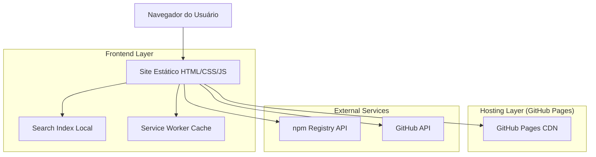
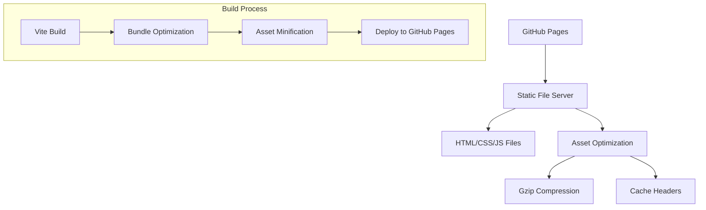
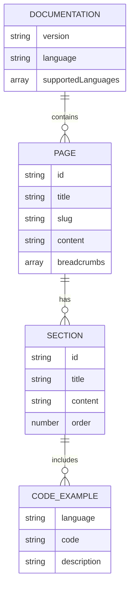

# Arquitetura Técnica - Site de Documentação CommitZero

## 1. Design da Arquitetura



## 2. Descrição das Tecnologias

* Frontend: HTML5 + CSS3 + Vanilla JavaScript ES6+ + Vite

* Styling: Tailwind CSS v3 + Custom CSS

* Build Tool: Vite v4 para bundling e otimização

* Hosting: GitHub Pages (site estático)

* APIs Externas: npm Registry API, GitHub API v4

## 3. Definições de Rotas

| Rota           | Propósito                                    |
| -------------- | -------------------------------------------- |
| /              | Página inicial com visão geral da biblioteca |
| /installation  | Guia de instalação e configuração inicial    |
| /configuration | Documentação detalhada de configuração       |
| /usage         | Instruções de uso do CLI e comandos          |
| /api-reference | Referência técnica da API                    |
| /examples      | Exemplos práticos e casos de uso             |
| /contributing  | Guia para contribuidores                     |
| /faq           | Perguntas frequentes e troubleshooting       |
| /changelog     | Histórico de versões e mudanças              |
| /pt-br/\*      | Versões em português de todas as páginas     |
| /es/\*         | Versões em espanhol de todas as páginas      |

## 4. Definições da API

### 4.1 APIs Externas

**npm Registry API**

```
GET https://registry.npmjs.org/@codemastersolutions/commitzero
```

Resposta:

| Nome do Parâmetro | Tipo do Parâmetro | Descrição                     |
| ----------------- | ----------------- | ----------------------------- |
| version           | string            | Versão mais recente publicada |
| downloads         | object            | Estatísticas de download      |
| license           | string            | Tipo de licença               |

Exemplo:

```json
{
  "name": "@codemastersolutions/commitzero",
  "version": "0.0.13",
  "description": "Conventional Commits validator...",
  "license": "MIT"
}
```

**GitHub API**

```
GET https://api.github.com/repos/codemastersolutions/commitzero
```

Resposta:

| Nome do Parâmetro   | Tipo do Parâmetro | Descrição                      |
| ------------------- | ----------------- | ------------------------------ |
| stargazers\_count   | number            | Número de stars no repositório |
| forks\_count        | number            | Número de forks                |
| open\_issues\_count | number            | Issues abertas                 |

## 5. Arquitetura do Servidor



## 6. Modelo de Dados

### 6.1 Definição do Modelo de Dados



### 6.2 Linguagem de Definição de Dados

**Estrutura de Configuração do Site**

```javascript
// site.config.js
const siteConfig = {
  title: 'CommitZero Documentation',
  description: 'Conventional Commits validator with friendly CLI',
  baseUrl: 'https://codemastersolutions.github.io/commitzero',
  languages: {
    en: {
      label: 'English',
      path: '/'
    },
    'pt-br': {
      label: 'Português',
      path: '/pt-br/'
    },
    es: {
      label: 'Español', 
      path: '/es/'
    }
  },
  navigation: [
    { title: 'Home', path: '/' },
    { title: 'Installation', path: '/installation' },
    { title: 'Configuration', path: '/configuration' },
    { title: 'Usage', path: '/usage' },
    { title: 'API Reference', path: '/api-reference' },
    { title: 'Examples', path: '/examples' },
    { title: 'Contributing', path: '/contributing' },
    { title: 'FAQ', path: '/faq' },
    { title: 'Changelog', path: '/changelog' }
  ]
};
```

**Estrutura de Conteúdo das Páginas**

```javascript
// content/pages/installation.js
export const installationPage = {
  id: 'installation',
  title: 'Installation Guide',
  slug: 'installation',
  sections: [
    {
      id: 'local-installation',
      title: 'Local Project Installation',
      content: 'Install as development dependency...',
      codeExamples: [
        {
          language: 'bash',
          code: 'npm i -D @codemastersolutions/commitzero',
          description: 'Install with npm'
        },
        {
          language: 'bash', 
          code: 'yarn add -D @codemastersolutions/commitzero',
          description: 'Install with yarn'
        }
      ]
    }
  ]
};
```

**Search Index Structure**

```javascript
// search/index.js
const searchIndex = [
  {
    id: 'installation-npm',
    title: 'NPM Installation',
    content: 'npm i -D @codemastersolutions/commitzero',
    url: '/installation#npm',
    category: 'installation'
  },
  {
    id: 'config-types',
    title: 'Configuration Types',
    content: 'types array defines allowed commit types',
    url: '/configuration#types',
    category: 'configuration'
  }
];
```

